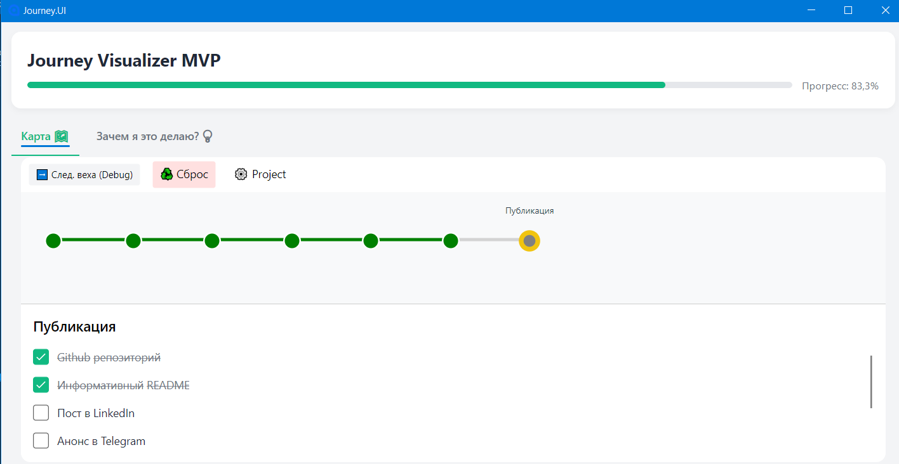

# Journey Visualizer
**Journey** — это не очередной таск-менеджер. 
Это инструмент для поддержания внутренней мотивации, созданный для тех, кто устал бросать сложные проекты на полпути.

[](https://opensource.org/licenses/MIT)


## 🧠 Проблема
Большинство трекеров задач фокусируются на «Что» (список дел), но полностью игнорируют «Зачем». 
В длинных проектах наступает этап «вязкой середины», когда дофамин от старта иссяк, а финиш еще далеко. 
В этот момент мозг забывает первоначальный смысл, и проект часто отправляются на «кладбище идей».

## 🎯 Решение (Гипотеза)
Приложение проверяет гипотезу: визуализация смысла и цены бездействия важнее, чем сам список задач.
Journey заставляет вас держать перед глазами три критических фактора:
- **The Goal (Куда я иду?):** конкретный осязаемый результат.
- **The Why (Зачем мне это?):** глубинная внутренняя мотивация.
- **The Failure Cost (Что я потеряю?):** отрицательная стимуляция — напоминание о том, что произойдет (или не произойдет), если вы сдадитесь.

## ✨ Ключевые функции (MVP)
- **Progress Tracking:** Визуальная шкала прогресса вашего проекта, привязанная к вехам (Milestones) и к задачам (Tasks).
- **Welcome Back Delta:** Приложение запоминает ваш прогресс и при следующем запуске показывает, насколько вы продвинулись с прошлого раза.
- **Motivation Dashboard:** Выделенный блок с вашей целью и «ценой провала».
- **Persistence:** Автоматическое сохранение состояния в локальный JSON-файл — ваши данные принадлежат только вам.
- **Focus Mode:** Минималистичный интерфейс, который не отвлекает от работы.

## 🛠 Технологический стек
- **Framework:** Avalonia UI (Cross-platform .NET UI)
- **Pattern:** MVVM (Model-View-ViewModel)
- **Language:** C#
- **Storage:** Local JSON Serialization

## 🚀 Как запустить
### Предварительные требования:
- .NET 8.0 SDK или выше.
- Git (для сборки из исходников)

### Запуск проекта (для чайников)
1. Перейдите на страницу с [релизами](https://github.com/meowl-p/Journey-Visualizer/tags)
2. Выберите любую доступную версию (самая верхняя - самая современная)
3. Во вкладке Assets лежит файл _journey.zip_. Скачайте его.
4. Распакуйте в любом месте и запустите _Journey.UI.exe_
5. Наслаждайтесь!

### Сборка проекта из исходников
1. Склонируйте репозиторий (в git bash):
```
git clone https://github.com/meowl-p/Journey-Visualizer.git
```
2. Перейдите в папку проекта:
```
cd journey/Journey.UI
```
3. Запустите проект:
```
dotnet run
```

## 🖼 Скриншоты из приложения


## 📊 План развития на ближайшее время
- [x] Система сохранения/загрузки прогресса.
- [x] Визуализация цели и мотивации.
- [ ] Динамическое управление списком задач (Добавление/Удаление внутри UI).
- [ ] Поддержка нескольких независимых проектов.
- [ ] Глобальные уведомления-напоминания.

## 📜 Лицензия
Проект распространяется под лицензией MIT. Делайте с ним что угодно, но не забывайте, зачем вы это начали.
## Примечание автора
Это приложение создано в первую очередь как эксперимент над собственной продуктивностью. Если оно поможет кому-то еще дожать свой "Project of a Lifetime" — значит, Journey был написан не зря.
